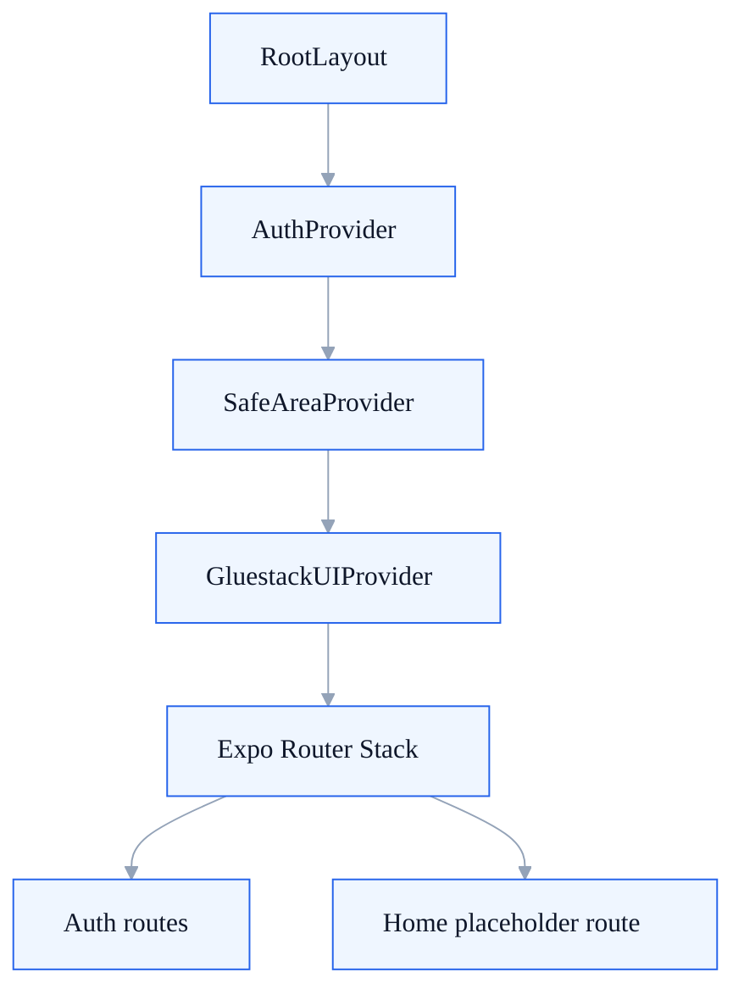
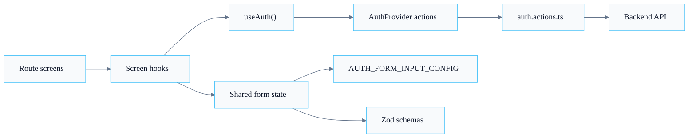

  Application
  <h1>The frontend shell is small: a root layout, an auth provider, and a route graph.</h1>
  

    The architecture is intentionally concentrated around the auth surface. The
    provider stack is narrow, and most behavior fans out from the auth module.
  

  

    Shell
    <h2>Root layout owns composition, not product logic.</h2>
    
The root layout wires providers and the stack. It is the right place to explain app-level concerns, not feature-level business rules.

  

  

    Module boundary
    <h2>The auth folder is the operational center.</h2>
    
Context, service calls, validation schemas, screen hooks, and auth-specific components are intentionally grouped in one feature module.

  

