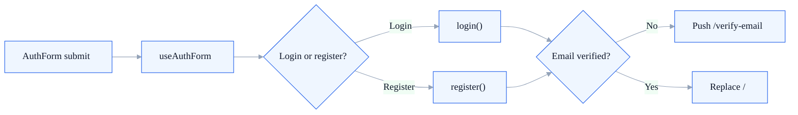
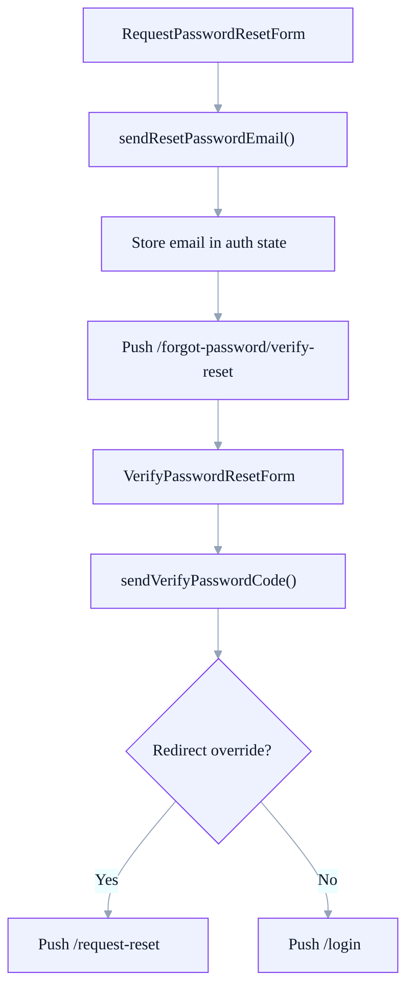

  Application
  <h1>The docs focus on the flows that actually ship today.</h1>
  

    Auth is the center of the current product scope. The flows below reflect the
    implemented hooks, provider actions, and route transitions that exist in the codebase now.
  

  

    Onboarding
    <h2>Login and registration converge on email verification.</h2>
    
Both entry points feed shared form infrastructure and eventually branch on the email verification state.

  

  

    Recovery
    <h2>Password reset depends on auth context preserving the email address.</h2>
    
This is a real implementation detail today and should be treated as part of the current flow contract.

  

  <strong>Clarification notes</strong>
  

    Two implementation details are intentionally documented as clarification points today:
    the email verification resend timer restarts before the resend request finishes, and the
    reset-verification flow assumes the auth context still contains the email address.
  

