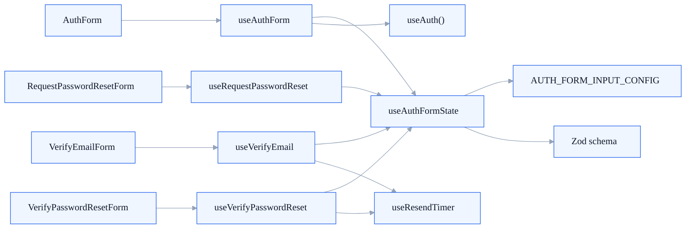

import Link from '@docusaurus/Link';

  Reference Guide
  <h1>The hook layer explains how auth behavior is assembled, not just where it lives.</h1>
  

    Each hook page answers two questions: what the hook is doing, and why the codebase keeps that behavior
    in a hook instead of inside the screen component directly.
  

  <Link className="doc-card doc-card--link" to="/docs/hooks/use-auth-form-state">
    Shared
    <h2>useAuthFormState</h2>
    
Builds the reusable React Hook Form and Zod state that the auth screens depend on.

  </Link>
  <Link className="doc-card doc-card--link" to="/docs/hooks/use-resend-timer">
    Shared
    <h2>useResendTimer</h2>
    
Owns the cooldown clock used by OTP resend flows.

  </Link>
  <Link className="doc-card doc-card--link" to="/docs/hooks/use-auth-form">
    Screen
    <h2>useAuthForm</h2>
    
Coordinates login and registration submit behavior for the shared auth form shell.

  </Link>
  <Link className="doc-card doc-card--link" to="/docs/hooks/use-request-password-reset">
    Screen
    <h2>useRequestPasswordReset</h2>
    
Owns the request-reset workflow from email entry through redirect to the verify step.

  </Link>
  <Link className="doc-card doc-card--link" to="/docs/hooks/use-verify-email">
    Screen
    <h2>useVerifyEmail</h2>
    
Combines verification submit logic, resend logic, timer state, and redirect behavior.

  </Link>
  <Link className="doc-card doc-card--link" to="/docs/hooks/use-verify-password-reset">
    Screen
    <h2>useVerifyPasswordReset</h2>
    
Runs the password-reset verification and resend workflow that the recovery flow depends on.

  </Link>

