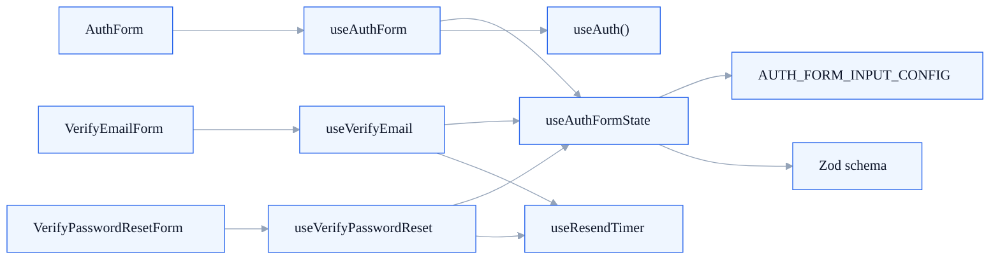

  Reference Guide
  <h1>The hook layer is where shared form state meets route-level behavior.</h1>
  

    The custom hooks are not generic utilities for the whole app. They are focused,
    auth-specific orchestration points that sit between the provider and the screen components.
  

  

    Shared
    <h2>useAuthFormState</h2>
    
Builds the reusable React Hook Form plus Zod state that most auth screens depend on.

  

  

    Shared
    <h2>useResendTimer</h2>
    
Owns the OTP cooldown window and the helper used to restart it.

  

  

    Screen
    <h2>useAuthForm</h2>
    
Handles login and registration submit behavior for the shared auth form shell.

  

  

    Screen
    <h2>useVerifyEmail / useVerifyPasswordReset</h2>
    
Drive the OTP-based verification and recovery flows, including resend and redirect logic.

  

