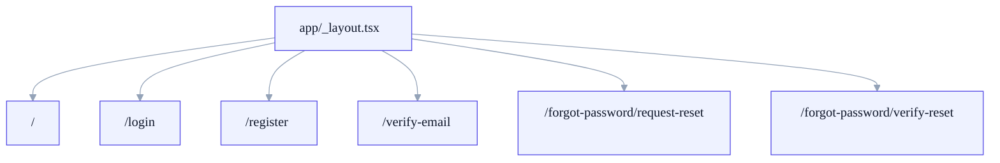

  Application
  <h1>The current navigation model is route-group based and almost entirely auth-focused.</h1>
  

    Most routes today live under <code>app/(auth)</code>. The home route exists,
    but it is still a placeholder and should not be treated as a finished product surface.
  

## Current Routes

| Route | Wrapper file | User-facing purpose |
| --- | --- | --- |
| `/login` | `app/(auth)/login.tsx` | Sign in flow |
| `/register` | `app/(auth)/register.tsx` | Create account flow |
| `/verify-email` | `app/(auth)/verify-email.tsx` | Submit OTP for email verification |
| `/forgot-password/request-reset` | `app/(auth)/forgot-password/request-reset.tsx` | Request reset code |
| `/forgot-password/verify-reset` | `app/(auth)/forgot-password/verify-reset.tsx` | Submit reset code and new password |
| `/` | `app/index.tsx` | Placeholder home screen |